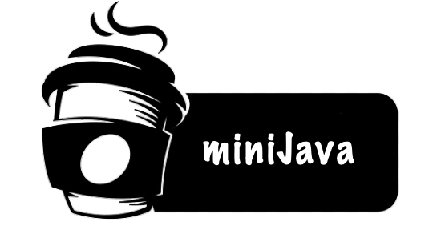

 

	
	
	    

MiniJava is a compact subset of Java that introduces both procedural and object-oriented programming concepts in a simplified form. It is designed for educational purposes in compiler construction and language processing courses, allowing you to explore key compilation phases—from lexical and syntax analysis to intermediate representation generation, code generation, and interpretation.

## Overview

MiniJava simplifies many of Java’s features while still supporting familiar concepts such as:

- **Static Typing & Scoping:** Like Java, MiniJava enforces static typing and scoping rules.
- **Single-File Source Code:** All MiniJava source code is written in a single file.
- **Simplified Class System:** All member fields and methods are public; no interfaces, abstract classes, or static methods/variables.
- **Primitive and Composite Types:** Supports primitive types (`int`, `char`, `boolean`, `string`), arrays, and user-defined classes.
- **Built-in Methods:** Includes basic operations for printing, string conversion, array manipulation, and assertions.
- **Procedural and Object-Oriented Constructs:** Allows both styles, giving you a taste of procedural programming (like C/C++) alongside object-oriented features.

## Language Features

MiniJava retains many familiar Java-like features while streamlining complexity:

- **Data Types**:
    + Primitive Types: `int` (`32-bit` integer), `char` (`8-bit` integer), boolean, and string.
    + Array Types: e.g., `int[]`, `char[]`.
    + Special Values: `null` to represent “no value” and `void` as a placeholder type.
- **Expressions & Operators**:
	+ Arithmetic, relational, and logical expressions are available, with standard operator precedence.
	+ Short-circuit evaluation is implemented for logical operators.
- **Control Structures**:
	+ Standard `if`, `while`, and `for` loops.
- **Functions and Methods**:
	+ Functions are defined with a return type and can be invoked using call-by-value semantics.
	+ Methods can be defined within classes; every method and field is public.
- **Object Orientation**:
	+ Classes in MiniJava support simple inheritance (a class may extend one super class).
	+ Constructors can be defined, and object instantiation uses the new keyword.
- **Built-in Methods**:
	+ Array operations (e.g., `length(array)`), assertions (`assert(expression)`), and conversion methods such as `atoi(str)` and `itoa(num)` are provided.
	+ Print operations include `print(a)` and `println(a)`.

For a complete grammar of MiniJava, you can refer to the [MiniJavaParser.g4](https://github.com/Ouhznehc/MiniJava/blob/main/src/MiniJavaParser.g4) file.